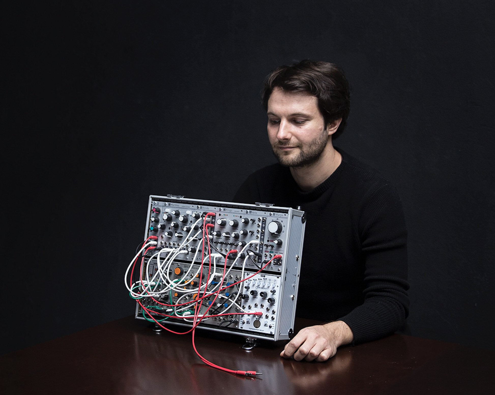
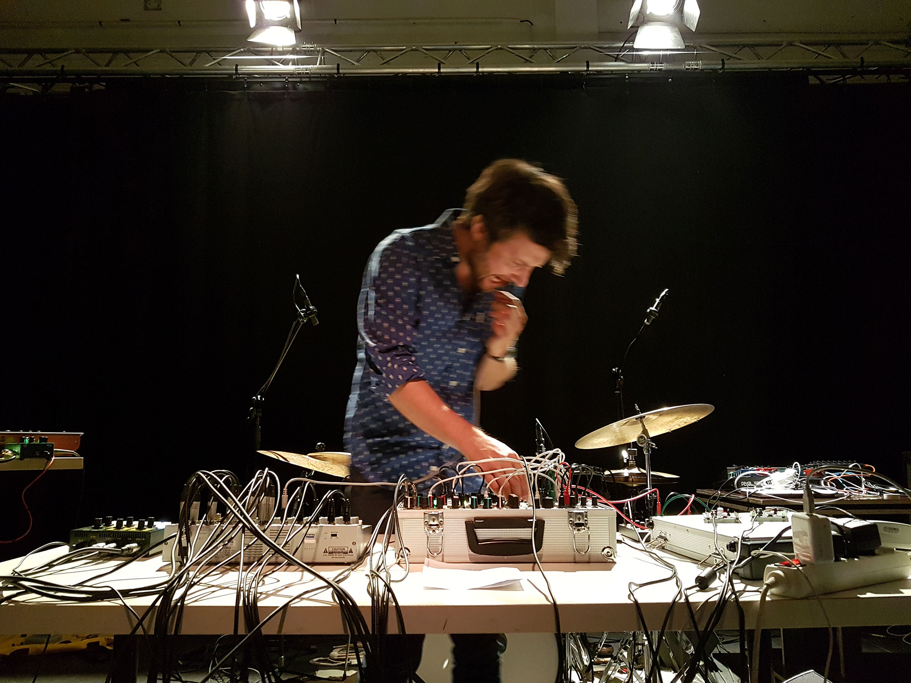
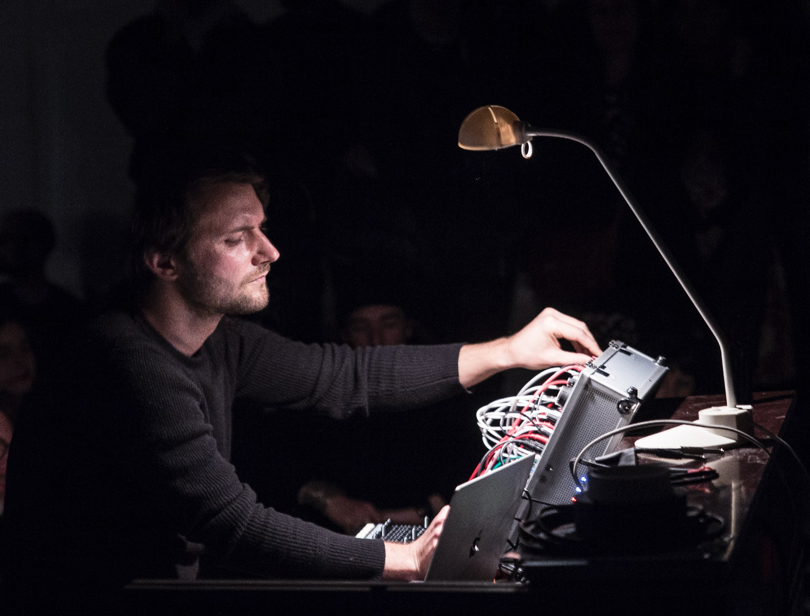

## About

Matthias Puech is a musician, programmer, researcher and teacher born
in Paris in 1983. Assistant Professor in Computer Science, he
nourishes a dual interest for natural phenomena, especially
evolutionary biology, and the mathematical and computational concepts
that let us apprehend our world. Interpreting "ambient" and "noise" in
their original sense, his compositions intend to disturb the
distinction between sound synthesis and field recording, transporting
the listener amidst imaginary ecosystems, fruits of the symbiotic
relationship of the machine to its environment. Matthias Puech designs
his own instruments using unique synthesis algorithms inspired by
physics and biology; he collaborates with manufacturers of modular
synthesizers who market his creations.

<figure>
  
  <figcaption>Credit: Nils Maisonneuve</figcaption>
</figure>

His academic research and teachings are focused on programming
languages and logic, but now include embedded programming for real
time signal processing application, especially sound synthesis and
processing. He has co-designed a Eurorack synthesizer module with the
American manufacturer [4ms Company](https://4mscompany.com/),
commercialized since 2017, in an ongoing collaboration. He has also
worked on firmware development for [Xaoc
Devices](http://xaocdevices.com/), and released a series of free and
open-source firmware projects for digital synthesizer modules, the
'Parasites'.

<figure>
  
  <figcaption>Credit: jjgfree</figcaption>
</figure>

Puech has released three full-length physical albums, one split album
in collaboration with Canadian sound artist Philippe Vandal, and one
EP, on labels Hisolat Records, Hylé Tapes, Panatype; his most recent
album 'Alpestres' dedicated to the high mountains and its myths, is
published jointly by Hands in the Dark and Obsolete Future. His music
has been reviewed in Libération, The Wire Magazine, Tiny Mix Tape,
Self-Titled. He has notably played live at Café Oto (London), 100ECS,
Péripate, Rinse France (Paris), CKUT Radio (Montréal) and has been
commissioned by Radio France & GRM for a live performance at Festival
Présences 2019.

<figure>
  
  <figcaption>Credit: Nils Maisonneuve</figcaption>
</figure>
