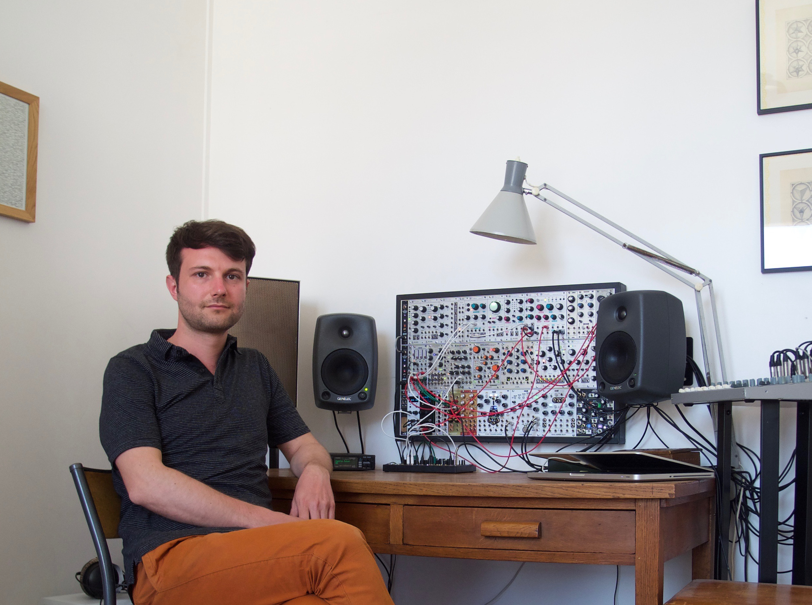

## About

Matthias Puech is a sound artist, designer, programmer, researcher and
teacher from Paris. He nourishes on a dual fascination between natural
phenomena and mathematical concepts. His compositions, contemplative
stills of imaginary landscapes, intend to blur the distinction between
sound synthesis and field recording, transporting the listener amidst
invented ecosystems. Puech designs his own digital electronic
instruments with the help of unique synthesis algorithms inspired from
physics and biology.

His music is in major part composed and interpreted on a modular
synthesizer, using specially-developed hardware and software. He
collaborates with several Eurorack modules manufacturers who build and
commercializes his creations (e.g., the 4ms Tapographic Delay).

