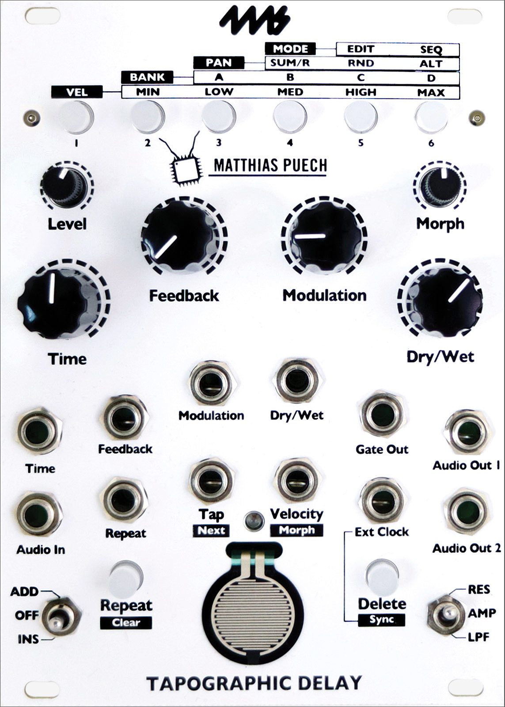
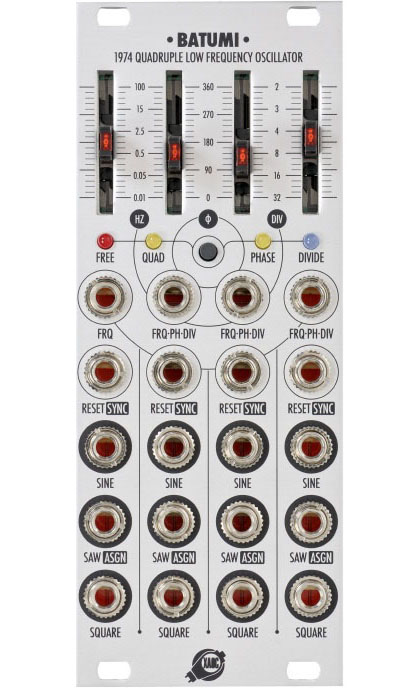

## Design & Development

---

### INA grm [GRM Tools](https://inagrm.com/en/store)

Software suite for creative sound processing.

> The GRM Tools Complete Collection is an un-compared set of 18 amazing plug-ins
that have been used by most renowned composers and sound designers around the
world. Each GRM Tools plug-ins offers powerful and unique sound transformation
and audio processing features. Conceived and crafted by the _GRM_ Group
([_Groupe de Recherches Musicales_](https://inagrm.com/)) of the famous National
Audiovisual Institute of Paris (France), GRM Tools Complete is the result of
numerous years of research, experimentation and development.

Lead designer and developer. Full redesign and re-implementation in progress.
_(2021--)_

---

### 4ms & Matthias Puech [Ensemble Oscillator](https://4mscompany.com/p.php?p=984)

Eurorack module, manufactured and commercialized by
[4ms](https://4mscompany.com/).

> The Ensemble Oscillator is a unified polyphonic voice of sixteen complex
oscillators combining additive, FM, phase-distortion and wavefolding synthesis
techniques in new unorthodox ways. By quantizing the oscillators to scales or
series of harmonics, the Ensemble Oscillator allows you to explore the sonic
boundary between musical chords and rich evolving textures. Easily create a wide
variety of sounds ranging from aggregates of pure sine waves to pulsar synthesis
or pristine harmonic tones and lush wide chords to rich dirty drones and
rumbling glitches. Custom scales can quickly be “learned” and saved using a CV
keyboard or by manually entering notes with the controls.

Original concept; design with Dan Green (4ms); full C++ embedded firmware
development. _(2018--2019)_

[Open source](https://github.com/4ms/enosc) under MIT license.

#### Press

- [Sound on Sound review](https://www.soundonsound.com/node/4922356) (by Stephan Whitlan, November 2020)
- [KR Home Studio review](https://www.kr-homestudio.fr/produit/kr352-la-guerre-des-clones-rodolphe-burger-fakear-bvo-tests-matos/) (by Pierre Estève, October 2020)

---

### 4ms & Matthias Puech [Tapographic Delay](https://4mscompany.com/p.php?p=790)

Eurorack module manufactured and commercialized by [4ms](https://4mspedals.com/).

> The [Tapographic Delay](https://4mscompany.com/p.php?p=790) is a complex
multi-tap delay in the Eurorack format with a unique interface designed for live
performance. It excels at transforming the simplest audio (a drone, a percussive
sound) into complex rhythmic structures, meshes of organic textures, lush
harmonic mille-feuilles, liquid and resonant effects. The Tapographic Delay is
an expressive experimental instrument meant to be played in real-time, rather
than a set-and-forget end-of-chain effect. Up to 32 taps per configuration,
smooth morphing between configurations, two feedback paths, and much more.

Original concept; design with Dan Green (4ms); full C++ embedded firmware
development _(2016--2017)_.

[Open source](https://github.com/4ms/tapographic-delay) under MIT license.

#### Press

- [Sound on Sound
  review](https://www.soundonsound.com/reviews/4ms-tapographic-delay)
  (Paul Nagle, May 2018)
- [Electronic Musician
  review](https://www.emusician.com/gear/mod-squad-4ms-mattias-puech-tapographic-delay)
  (Gino Robair, April 2018)

---

### Xaoc Devices [Batumi](https://xaocdevices.com/main/batumi/)

Eurorack module manufactured and commercialized by [XAOC](https://xaocdevices.com).

> Batumi is a fully voltage controlled, quadruple digital LFO module with a slew
of interesting and user-customizable features. Each oscillator can be used
independently or in one of 3 synchronized modes: quadrature, phase and divide.
For each oscillator, there are sine, square and assignable (saw, ramp, triangle
and trapezoid) waveform otputs available. Voltage control is possible for each
oscillator’s frequency, reset, and external sync (“tap tempo”).

Re-developed from scratch and improved upon the main firmware starting from the
existing hardware; developed an alternative "expert" firmware for [Xaoc
Devices](https://xaocdevices.com/), adding advanced functionality. _(2016)_

[Open source](https://github.com/mqtthiqs/batumi) under MIT license.

---

### [Parasites](https://mqtthiqs.github.io/parasites/) for Mutable Instruments

Unofficial, alternative firmware for Eurorack modules designed, manufactured and
commercialized by [Mutable Instruments](https://mutable-instruments.net/); changing
the factory function and adding new features.

> A parasite is an organism living in or on another, benefiting unilaterally from
> its host. Parasites is a series of free and open source alterative firmwares
> for the Eurorack modules from Mutable Instruments. Their purpose is to enhance
> existing features, and add new function and hidden modes, retaining as much as
> possible factory functionality.

Designed and implemented [four open-source alternative
embedded software](https://mqtthiqs.github.io/parasites/) _(2015--2016)_ :

- [Clouds Parasite](https://mqtthiqs.github.io/parasites/clouds.html)
- [Frames Parasite](https://mqtthiqs.github.io/parasites/frames.html)
- [Tides Parasite](https://mqtthiqs.github.io/parasites/tides.html)
- [Warps Parasite](https://mqtthiqs.github.io/parasites/warps.html)

[Open source](https://github.com/mqtthiqs/parasites) under MIT license.

