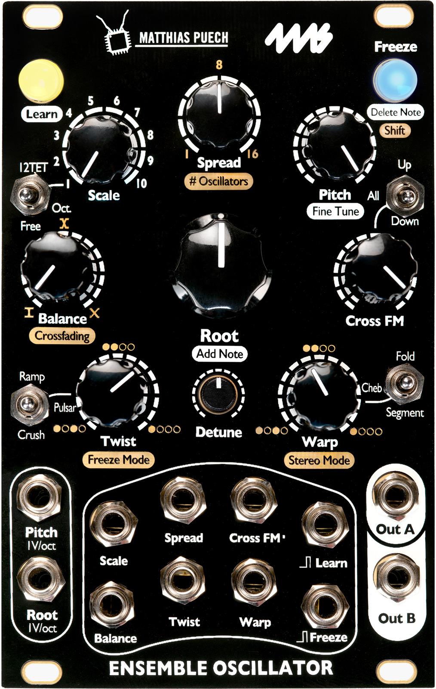

## Projects

### 4ms & Matthias Puech _Ensemble Oscillator_

Co-designed and developed the [Ensemble
Oscillator](http://4mscompany.com/p.php?p=984) Eurorack module,
manufactured and commercialized by [4ms](http://4mspedals.com/). The
Ensemble Oscillator is a unified polyphonic voice of sixteen complex
oscillators combining additive, FM, phase-distortion and wavefolding
synthesis techniques in new unorthodox ways. By quantizing the
oscillators to scales or series of harmonics, the Ensemble Oscillator
allows you to explore the sonic boundary between musical chords and
rich evolving textures. Easily create a wide variety of sounds ranging
from aggregates of pure sine waves to pulsar synthesis or pristine
harmonic tones and lush wide chords to rich dirty drones and rumbling
glitches. Custom scales can quickly be “learned” and saved using a CV
keyboard or by manually entering notes with the controls.

(2018-2019)

### 4ms & Matthias Puech _Tapographic Delay_

Co-designed with [4ms](https://4mscompany.com/index.php) and developed
the [Tapographic Delay](https://4mscompany.com/p.php?p=790), a
Eurorack module manufactured and commercialized by
[4ms](http://4mspedals.com/). The Tapographic Delay is a complex
multi-tap delay in the Eurorack format with a unique interface
designed for live performance. It excels at transforming the simplest
audio (a drone, a percussive sound) into complex rhythmic structures,
meshes of organic textures, lush harmonic mille-feuilles, liquid and
resonant effects. The Tapographic Delay is an expressive experimental
instrument meant to be played in real-time, rather than a
set-and-forget end-of-chain effect. Up to 32 taps per configuration,
smooth morphing between configurations, two feedback paths, and much
more.

(2016–2017)

- [Sound on Sound
  review](https://www.soundonsound.com/reviews/4ms-tapographic-delay)
  (Paul Nagle, May 2018)
- [Electronic Musician
  review](https://www.emusician.com/gear/mod-squad-4ms-mattias-puech-tapographic-delay)
  (Gino Robair, April 2018)

### Parasites

Developed [four open-source alternative pieces of
firmware](http://mqtthiqs.github.io/parasites/) for Eurorack modules
from [Mutable Instruments](https://mutable-instruments.net/), changing
their primary function and adding new features.

(2015-2016)

### Xaoc Devices Batumi

Re-developed from scratch and improved upon the main firmware for this
[Eurorack module](http://xaocdevices.com/main/batumi/), starting from
the existing hardware, and developed an alternative "expert" firmware
for [Xaoc Devices](http://xaocdevices.com/), adding advanced
functionality. The open-source code can be found
[here](https://github.com/xaocdevices/batumi).

(2016)
